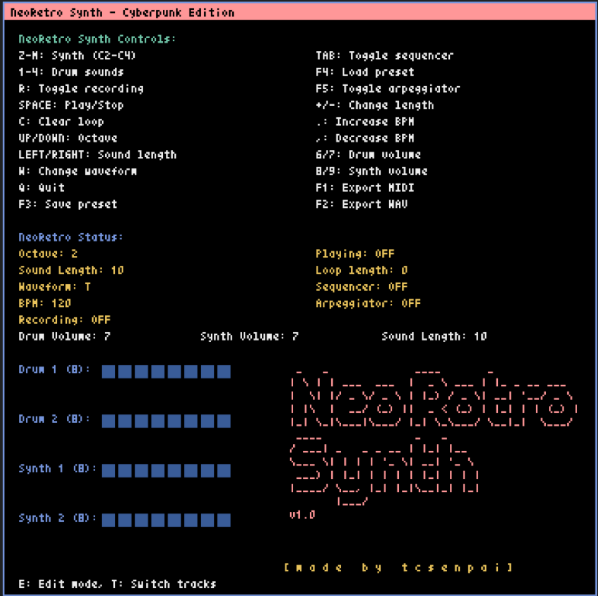

# NeoRetro Synth - Cyberpunk Edition

NeoRetro Synth is a retro-style synthesizer and drum machine with a cyberpunk aesthetic, built using the Pyxel library for Python.



## Disclaimer

This project is created for fun and educational purposes. As with any experimental software, bugs and unexpected behavior may occur. Use at your own risk and enjoy the creative process!

## Installation

Clone the repository with 

`git clone https://github.com/tcsenpai/neoretrosynth.git`

Then 

```
cd neoretrosynth
pip install -r requirements.txt
```

Now you can run the application with 
`python main.py`

## Features

- 4 tracks: 2 drum tracks and 2 synth tracks
- 8-step dynamically sized sequencers for each track (expandable up to 32 steps)
- Multiple waveforms for synth sounds: Triangle, Square, Pulse, and Noise
- Drum sounds: Kick, Snare, Hi-hat, and Open hi-hat
- Real-time keyboard input for playing notes
- Adjustable octave, sound length, and BPM
- Loop recording and playback functionality
- Arpeggiator with customizable pattern
- Volume control for both drum and synth tracks
- MIDI and WAV export capabilities
- Preset saving and loading
- Edit mode for fine-tuning sequencer patterns
- Cyberpunk-inspired user interface

## Controls

All controls are displayed in the GUI for easy reference. Key features include:

- Z-M keys: Play synth notes (C2-C4)
- 1-4 keys: Play drum sounds
- R: Toggle recording
- SPACE: Play/Stop loop
- C: Clear loop
- UP/DOWN arrows: Change octave
- LEFT/RIGHT arrows: Adjust sound length
- W: Change waveform
- TAB: Toggle sequencer
- E: Enter/Exit edit mode
- T: Switch edit target (in edit mode)
- +/-: Change sequencer length (in edit mode)
- .: Increase BPM
- ,: Decrease BPM
- 6/7: Adjust drum volume
- 8/9: Adjust synth volume
- F1: Export to MIDI
- F2: Export to WAV
- F3: Save preset
- F4: Load preset
- F5: Toggle arpeggiator
- Q: Quit application

## Sequencer

- 4 tracks: 2 drum tracks and 2 synth tracks
- Each track has an 8-step sequencer, expandable up to 32 steps
- Edit mode allows for detailed pattern creation and modification
- Dynamic length adjustment for each sequencer

## Sound Generation

- Synth tracks use multiple waveforms: Triangle, Square, Pulse, and Noise
- Drum tracks have four distinct sounds: Kick, Snare, Hi-hat, and Open hi-hat
- Adjustable sound length and volume for both synth and drum sounds

## Export Options

- MIDI export: Saves the current sequence as a MIDI file
- WAV export: Renders the current sequence as a WAV audio file

## Additional Features

- Preset system for saving and loading synth configurations
- Arpeggiator with customizable pattern
- Real-time visual feedback in the GUI
- Cyberpunk-inspired color scheme and design

## Requirements

- Python 3.x
- Pyxel library
- NumPy
- SciPy

## Usage

Run the `main.py` file to start the NeoRetro Synth application. Use the on-screen controls or keyboard shortcuts to create and manipulate sounds and sequences.


## License

NeoRetro Synth is released under the DO WHAT THE FUCK YOU WANT TO PUBLIC LICENSE (WTFPL), Version 2, December 2004. This means you are free to do whatever you want with this software.

For the full license text, please see the [LICENSE.md](LICENSE.md) file or visit [http://www.wtfpl.net/](http://www.wtfpl.net/) for more information.

Copyright (C) 2024 tcsenpai <tcsenpai@discus.sh>
